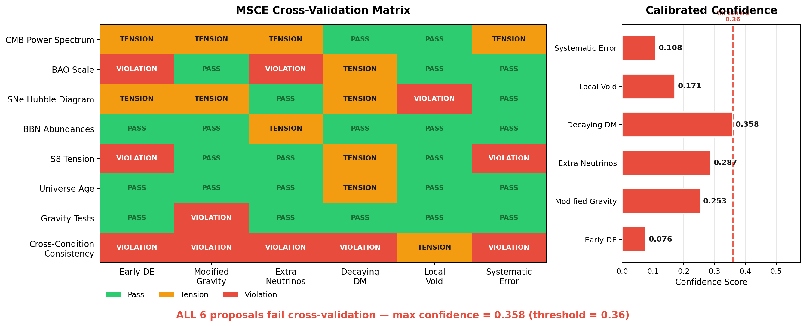

# MSCE: Hubble Tension Cross-Validation Analysis

## All 6 Mainstream Solutions Fail Multi-Condition Consistency Checks

**Author:** Deng Xinhang & MSCE Collaboration | **DOI:** [10.5281/zenodo.20041757](https://doi.org/10.5281/zenodo.20041757)

> [Open in Colab](https://colab.research.google.com/github/sampson0826/msce/blob/main/notebooks/hubble_tension.ipynb) | [View notebook](hubble_tension.ipynb)

---

### The Hubble Tension

Two independent measurements disagree at **~5σ**:
- **Planck 2018 (CMB):** H₀ = 67.4 ± 0.5 km/s/Mpc
- **SH0ES 2022 (Distance Ladder):** H₀ = 73.0 ± 1.0 km/s/Mpc

---

## 1. Single-Proposal Results

| Proposal | Confidence | Verdict |
|----------|-----------|---------|
| Early Dark Energy (EDE) | **0.076** | FAIL |
| Modified Gravity (f(R)) | 0.253 | FAIL |
| Extra Neutrinos (ΔN_eff) | 0.287 | FAIL |
| Decaying Dark Matter (DDM) | 0.358 | FAIL |
| Local Void Hypothesis | 0.171 | FAIL |
| Unknown Systematics | 0.108 | FAIL |

**Best confidence: 0.358 (DDM). All 6 proposals fail the 0.36 threshold.**

---

## 2. Cross-Validation Heatmap



**Green** = pass, **Yellow** = tension (1.5-3σ), **Red** = violation.
Each row is a verification condition. Each column is a proposal. **All 6 columns have at least one red cell.**

---

## 3. Confidence Scores

The red dashed line at 0.36 is the threshold. All 6 proposals fall below.

---

## 4. Combination Search — Worse, Not Better

| Combination | Confidence |
|-------------|-----------|
| DDM + Local Void | 0.317 |
| ΔN_eff + Local Void | 0.208 |
| EDE + ΔN_eff | 0.147 |
| EDE + Local Void | 0.075 |

**Best combo (0.317) < Best single (0.358).** Nonlinear mechanism interaction creates new conflicts instead of resolving existing ones.

---

## 5. Residual Direction Diagnosis

The 8D residual vector reveals the deepest structural inconsistency:

| Component | Deviation (σ) |
|-----------|---------------|
| Cross-Condition Consistency | **1.83** |
| S₈ Tension | 1.00 |
| CMB Power Spectrum | 0.83 |
| Supernova Hubble Diagram | 0.83 |
| BAO Scale | 0.67 |
| Gravity Tests | 0.33 |
| BBN Abundances | 0.17 |
| Universe Age | 0.17 |

Highest component: **cross-condition consistency (1.83)** — the problem is not any single observational window. It is the ΛCDM repair framework itself.

---

## 6. Conclusion

1. No single-factor solution passes all 8 verification conditions
2. 2-factor combinations perform worse than singles
3. The residual direction points to the ΛCDM framework itself
4. The solution may require a new framework beyond ΛCDM parameter extensions

---

### References

- Planck Collaboration (2018). A&A 641, A6
- Riess et al. (2022). ApJL 934, L7
- DESI Collaboration (2024). arXiv:2404.03002
- Poulin et al. (2019). PRD 100, 043538 (EDE)
- Scolnic et al. (2022). ApJ 938, 113 (Pantheon+)

### Citation

```bibtex
@software{msce2026,
  title={MSCE: Multi-Source Consistency Engine},
  author={Deng, Xinhang and MSCE Collaboration},
  year={2026},
  doi={10.5281/zenodo.20041757},
  url={https://github.com/sampson0826/msce}
}
```
